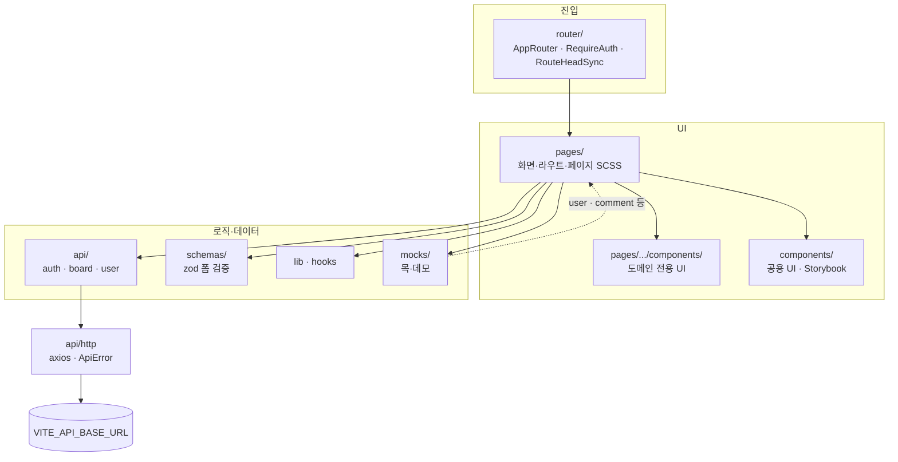

# React Practice

Vite + React + TypeScript 기반 프론트엔드 연습·포트폴리오 프로젝트입니다.  
로그인·회원가입·사용자 목록·상세(목 데이터)·마이페이지(내가 쓴 글)·게시판(목록·상세·작성·수정·삭제·조회수·검색·정렬·모바일 카드 / 데스크톱 테이블·댓글 UI·이미지 첨부·RichTextEditor)·일정(월 달력·연·월 선택·주 시작·한국 공휴일·localStorage 저장·달력 표시·입력 패널 / 좁은 화면 시트)·스타일 가이드·다크 모드·접근성(페이지 제목·스킵 링크·라우트 안내 등)을 다룹니다.

## 링크

|                      | URL                                                    |
| -------------------- | ------------------------------------------------------ |
| **Storybook (배포)** | https://sooozi.github.io/react-prtc01/                 |
| **Storybook (로컬)** | http://localhost:6006 — `yarn storybook` (Node 20.19+) |

`main` 브랜치 push 시 [`.github/workflows/deploy-storybook.yml`](.github/workflows/deploy-storybook.yml)로 Storybook 정적 사이트가 GitHub Pages에 올라갑니다. 최초 1회는 저장소 **Settings → Pages → Build and deployment → Source: GitHub Actions** 를 켜야 합니다.

---

## 아키텍처 (pages / api / components)



| 계층           | 폴더                    | 역할                                                               |
| -------------- | ----------------------- | ------------------------------------------------------------------ |
| **pages**      | `src/pages/{도메인}/`   | URL에 대응하는 화면. 한 도메인만 쓰는 UI는 `pages/.../components/` |
| **components** | `src/components/`       | 여러 화면에서 재사용하는 UI (`Button`, `Layout`, `Pagination` …)   |
| **api**        | `src/api/{도메인}/`     | HTTP 호출만 (JSX·훅 없음). 공통 클라이언트는 `api/http/`           |
| **schemas**    | `src/schemas/{도메인}/` | zod 폼 스키마 (로그인·회원가입 등)                                 |

상세 트리·파일 배치 규칙은 아래 [프로젝트 구조](#프로젝트-구조), [docs/folder-structure.md](docs/folder-structure.md) 를 참고하세요.

---

## 프로젝트 범위

React + TypeScript + Vite로 인증/게시판/마이페이지/일정/스타일 가이드 화면을 구현한 개인 프로젝트입니다. 게시판은 CRUD, 검색, 정렬, 페이지네이션, Quill 에디터, 이미지 첨부·순서·확장자 allowlist까지 포함했고, 목록은 데스크톱 테이블·모바일 카드로 반응형 처리했습니다. Axios로 외부 REST API에 연동하고 401 처리, 로그인 리다이렉트 안내, 예외 상황 UX를 정리했습니다. 사용자 목록·상세, 댓글 일부, 일정 저장은 mock·localStorage·데모 UI로 구성했고 백엔드 일부는 프로젝트 범위에서 제외했습니다.

---

### 데이터·백엔드 경계

| 구분                                 | 방식             | 비고                                                                               |
| ------------------------------------ | ---------------- | ---------------------------------------------------------------------------------- |
| 로그인·회원가입·게시판·내 글 목록 등 | **실 HTTP**      | `VITE_API_BASE_URL` 필요                                                           |
| 사용자 목록·사용자 상세              | **프론트 mock**  | `src/mocks/user.ts`, API 없이 목록 형태 학습용                                     |
| 댓글 영역                            | **프론트 데모**  | `src/mocks/comment.ts` — 목록·무한 스크롤만 동작. 등록·대댓글·정렬·실삭제는 미연결 |
| 일정                                 | **localStorage** | `scheduleItems` 키로 저장, `MonthCalendar`에 표시. 서버 동기화·수정·삭제 없음      |

### 데모·미연결 UI (레포 상태)

아래는 화면은 있지만 기본 플로우에서 아직 끝까지 연결되지 않은 항목입니다.

| 항목                  | 상태                                                              |
| --------------------- | ----------------------------------------------------------------- |
| 댓글 등록·대댓글·정렬 | 버튼·select는 UI만 (`disabled` 또는 로컬 state만)                 |
| 댓글 삭제 `Confirm`   | 확인 후 목록에서 제거하지 않음                                    |
| 일정 수정·삭제        | 미구현 (입력·달력 표시만)                                         |
| 전역 Toast            | 스타일 가이드 미리보기(`SgPreviewToast`)만, 앱 전역 Provider 없음 |
| MSW                   | `docs/folder-structure.md`에 언급만, 레포에는 미설치              |

### 실험·선택 도구

| 항목                                              | 상태                                                                                                |
| ------------------------------------------------- | --------------------------------------------------------------------------------------------------- |
| `backstop.json`                                   | **선택** 시각 회귀용. `package.json`에 `backstopjs`가 있어도 `yarn` 스크립트로는 자동 실행하지 않음 |
| SCSS 마이그레이션 스크립트 (`scripts/apply-*.py`) | **제거됨** — 스타일은 수동 토큰(`v.fs` 등) 사용                                                     |

---

## 기술 스택

| 구분            | 기술                                                                                                                    |
| --------------- | ----------------------------------------------------------------------------------------------------------------------- |
| **런타임**      | Node.js 20.19+ (Vite 7 권장)                                                                                            |
| **빌드/개발**   | Vite 7.x                                                                                                                |
| **프레임워크**  | React 19.x                                                                                                              |
| **언어**        | TypeScript 5.9.x                                                                                                        |
| **라우팅**      | React Router DOM 7.x                                                                                                    |
| **헤드·타이틀** | react-helmet-async                                                                                                      |
| **폼**          | React Hook Form 7.x + **Zod** (`@hookform/resolvers`)                                                                   |
| **HTTP**        | Axios                                                                                                                   |
| **에디터·본문** | Quill 2 (`react-quill-new`) · **DOMPurify** (상세 HTML 표시)                                                            |
| **스타일**      | Sass (SCSS), CSS 변수(테마), 설계 토큰 `v.space` / `v.fs` / `v.fw` / `v.rad` 등                                         |
| **기타**        | clsx · **date-holidays** + `src/lib/` (달력 공휴일)                                                                     |
| **품질**        | ESLint 9 + typescript-eslint + **eslint-plugin-jsx-a11y** · **Vitest** · **Storybook 10** · 개발 시 **@axe-core/react** |

---

## 환경 요구사항

- **Node.js**: **20.19 이상 필수** (Vite 7·Storybook 10). 루트 `.nvmrc`는 `20.19.0`입니다. `20.11.x` 등에서는 `yarn storybook`이 거부됩니다.
- **패키지 매니저**: Yarn (`yarn.lock` 기준)

`nvm` 사용 시 프로젝트 루트에서 `nvm use`로 버전을 맞출 수 있습니다.

---

## 설치 및 실행

```bash
yarn install

# API 연동 시: 루트 env 설정
# - 팀 공통: .env.development (기본값)
# - 개인별: .env.local (override, 커밋 금지)
# - 예시: .env.example 참고
# VITE_API_BASE_URL=<API 서버 베이스 URL>

yarn dev           # http://localhost:5173
yarn build         # tsc -b && vite build
yarn preview
yarn lint          # ESLint (jsx-a11y 포함)
yarn test          # Vitest 단위 테스트 (1회)
yarn test:watch    # Vitest watch
yarn format:check  # Prettier 포맷 검사 (CI·PR 전 확인용)
yarn format        # Prettier로 일괄 포맷 (필요할 때만 실행)

# Storybook (Node 20.19+ 필요 — 먼저 nvm use)
yarn storybook        # http://localhost:6006
yarn build-storybook  # storybook-static/ 정적 빌드
```

---

## Storybook

공통 UI 컴포넌트를 앱 전체를 띄우지 않고 **Canvas / Docs**에서 확인·문서화합니다.

- **배포 URL**: https://sooozi.github.io/react-prtc01/ (위 [링크](#링크)와 동일)
- **로컬**: `yarn storybook` → http://localhost:6006

### 실행

```bash
nvm use          # v20.19.0 확인
yarn storybook   # http://localhost:6006
```

`yarn storybook` 실행 전 `scripts/check-node-version.mjs`가 Node 버전을 검사합니다.

### 설정 위치

| 경로                              | 역할                                                                                   |
| --------------------------------- | -------------------------------------------------------------------------------------- |
| `.storybook/main.ts`              | 스토리 glob, addon, Vite `@` alias                                                     |
| `.storybook/preview.tsx`          | 전역 SCSS(`reset`, `common-global`), Quill CSS, `data-theme`, 사이드바 **알파벳 정렬** |
| `src/components/**/*.stories.tsx` | 컴포넌트 옆 co-location 스토리                                                         |
| `scripts/check-node-version.mjs`  | Storybook 최소 Node 버전 안내                                                          |

### 스토리가 있는 컴포넌트 (Components)

`ApiErrorBar`, `Badge`, `BoardListDataSkeleton`, `Button`, `Confirm`, `ErrorBoundary`, `Footer`, `Header`, `Icons`, `ImageFileAttachField`, `Layout`, `LoadingState`, `PageHeader`, `Pagination`, `PostDetailDataSkeleton`, `PostHtmlContent`, `RichTextEditor`, `TableSortHeader`, `Tooltip` 등.

`Layout`은 `MemoryRouter` + `<Outlet />` placeholder로 스토리를 구성합니다.

### 스토리 작성 요약

1. `ComponentName.stories.tsx`를 컴포넌트 폴더에 추가 (`tags: ['autodocs']` 선택).
2. `title: 'Components/이름'` — 사이드바 경로.
3. **Router** (`Button`의 `to` 등): `MemoryRouter` decorator.
4. **전역 상태** (`ApiErrorBar`): `setGlobalApiErrorText` + `useEffect` cleanup decorator.
5. **필수 props**가 있는 컴포넌트: `meta.render` + 각 스토리 `args` (TableSortHeader 참고).

빌드 산출물 `storybook-static/`은 `.gitignore`에 포함됩니다.

---

## 테스트

| 명령              | 설명                 |
| ----------------- | -------------------- |
| `yarn test`       | Vitest 1회 실행      |
| `yarn test:watch` | 변경 감지 watch 모드 |

현재 단위 테스트 (예):

- `src/components/ImageFileAttachField/lib/attachmentAllowlist.test.ts` — 첨부 확장자·MIME allowlist
- `src/lib/a11y/formDescribedBy.test.ts` — 폼 `aria-describedby` 헬퍼

설정: `vitest.config.ts`. Playwright browser runner(`@vitest/browser-playwright`)는 devDependency로 포함되어 있으나, 앱 E2E 스위트는 아직 없습니다.

---

## 환경 변수 (.env)

| 변수                | 설명                                                                                                                                                                                                                              |
| ------------------- | --------------------------------------------------------------------------------------------------------------------------------------------------------------------------------------------------------------------------------- |
| `VITE_API_BASE_URL` | API 베이스 URL. 로그인·회원가입·게시판·내 글 목록 등 axios 연동에 사용. 미설정 시 해당 호출은 실패할 수 있음. **사용자 목록·상세**는 `src/mocks/user.ts`만 사용해 이 변수와 무관함. 저장소에는 올리지 않음 (`.env.example` 참고). |

---

## 프로젝트 구조

```
.storybook/              # Storybook (main.ts, preview.tsx)
scripts/
  check-node-version.mjs # storybook 실행 전 Node 20.19+ 검사
  check-contrast-tokens.mjs
  capture-a11y-screenshots.mjs

src/
├── api/
│   ├── http/          # axios 클라이언트, ApiError, 래퍼
│   ├── auth/          # 로그인, 회원가입, 토큰, 로그인 리다이렉트 세션
│   ├── board/         # 게시판 API·타입
│   └── user/          # 사용자 API 래퍼(목록·상세는 mock)
├── components/        # 앱 전역 UI (index.ts 배럴) · *.stories.tsx (Storybook)
│   ├── Layout/, Button/, PageHeader/, DataSkeleton/, RouteSkeleton/, …
│   ├── RichTextEditor/   # editor(Quill) · display(PostHtmlContent + DOMPurify)
│   ├── ImageFileAttachField/
│   │   ├── index.ts              # 공개 API (컴포넌트·타입·유틸 re-export)
│   │   ├── ImageFileAttachField.tsx
│   │   ├── types.ts
│   │   ├── variants/             # Create(등록), UnifiedEdit(수정)
│   │   ├── ui/                   # AttachRowBody, ReorderGhostPortal, Shell
│   │   ├── hooks/                # useImageAttachReorder, useFileAddNotice
│   │   └── lib/                  # attachmentAllowlist, fileAttachItemUtils,
│   │                             # filterImageFiles, unifiedRowDisplay, fileAddMessages
│   └── icons/
├── hooks/             # usePagination, useUrlQueryPage, useFloatingLayer, useMediaQuery
├── lib/               # UI 없는 순수 TS (도메인별 하위 폴더)
│   ├── a11y/          # formDescribedBy
│   ├── holidayUtils.ts, krHolidays.ts
│   ├── post/          # boardListSort, postDetailFromQuery, postFormFieldErrors
│   └── schedule/      # calendarUtils
├── schemas/           # zod 폼 스키마 (auth/login, auth/signup)
├── mocks/             # 목·데모 데이터
│   ├── user.ts
│   └── comment.ts     # 게시판 댓글 데모
├── pages/             # 라우트 페이지 (도메인별)
│   ├── home/          # Home, HomeMarquee
│   ├── about/
│   ├── style-guide/   # StyleGuide — 토큰·컴포넌트 미리보기
│   ├── auth/
│   │   ├── styles/    # _auth-shared.scss
│   │   ├── login/
│   │   └── signup/
│   ├── errors/
│   │   ├── styles/    # _error-page-shared.scss
│   │   ├── forbidden/
│   │   └── not-found/
│   ├── user/
│   │   ├── list/, detail/, my-page/
│   ├── post/
│   │   ├── list/, detail/, write/, update/
│   │   └── components/   # CommentSection, CommentRow
│   └── schedule/
│       ├── Schedule.tsx, Schedule.scss
│       └── components/
│           ├── calendar/       # MonthCalendar, CalendarPickerPopover
│           └── side-panel/     # SidePanel (localStorage 저장)
├── router/
│   ├── AppRouter.tsx
│   ├── LazyRoute.tsx
│   ├── RequireAuth.tsx
│   ├── RouteHeadSync.tsx
│   └── routeDocumentMeta.ts
├── styles/
├── utils/
├── bootstrapAxe.ts
├── App.tsx
└── main.tsx
```

### 폴더 역할 (pages 기준)

| 위치                               | 용도                                                                                 |
| ---------------------------------- | ------------------------------------------------------------------------------------ |
| `pages/{도메인}/{라우트}/`         | URL에 대응하는 페이지 컴포넌트 + 스타일                                              |
| `pages/{도메인}/components/`       | 해당 도메인 전용 UI (전역 `components/`와 구분)                                      |
| `src/lib/`                         | 여러 페이지·컴포넌트가 쓰는 순수 로직                                                |
| `src/mocks/`                       | mock·데모 데이터                                                                     |
| `src/hooks/`                       | 재사용 커스텀 훅                                                                     |
| `components/ImageFileAttachField/` | `variants/`(등록·수정), `ui/`(행·드래그 고스트), `lib/`(allowlist·필터·unified 표시) |

- **경로 별칭**: `@` → `src`
- **배럴**: `@/components` — `ImageFileAttachField`, `RichTextEditor`, `PostHtmlContent`, `filesToItemsWithIds`, `isAllowedAttachmentFile`, `MAX_ATTACHMENT_FILENAME_LENGTH` 등 export

---

## 라우팅

| 경로                                                                | 페이지              | 비고                                                  |
| ------------------------------------------------------------------- | ------------------- | ----------------------------------------------------- |
| `/`                                                                 | -                   | `/home` 리다이렉트                                    |
| `/home`                                                             | Home                | 랜딩                                                  |
| `/auth/login`, `/auth/signup`                                       | Login, Signup       |                                                       |
| `/about`                                                            | About               |                                                       |
| `/style-guide`                                                      | StyleGuide          | 디자인 토큰·UI 미리보기 (공개)                        |
| `/forbidden`, `/not-found`                                          | Forbidden, NotFound |                                                       |
| `/user/list`, `/user/detail?userId=`                                | User 목록·상세      | 로그인 불필요, 사용자 데이터는 mock                   |
| `/user/mypage`                                                      | MyPage              | 로그인 필수                                           |
| `/post/list`, `/post/detail?id=`, `/post/write`, `/post/update?id=` | 게시판              | 로그인 필수 · 상세에서 `from` 쿼리로 복귀 경로 처리   |
| `/schedule`                                                         | Schedule            | 로그인 필수 · localStorage 저장·달력 표시 (서버 없음) |
| `*`                                                                 | -                   | `/not-found` 로 리다이렉트                            |

공개 라우트도 **항상 `<Layout>`** 안에서 렌더되어 `<main id="main-content">` 랜드마크가 유지됩니다.  
보호 라우트는 토큰 없을 때 로그인으로 이동하며 리다이렉트 state·sessionStorage 토스트를 넘길 수 있습니다.

**헤더(요약)**: 로고, 테마 토글, 햄버거 드로어 메뉴(About · Style · User · Board · Schedule), 로그인 시 프로필·로그아웃.

---

## 주요 기능 요약

- **다크 모드**: `data-theme`, `localStorage.theme`, `_color.scss` 변수.
- **문서 제목·접근성 보조**: `RouteHeadSync` + `routeDocumentMeta` — `<title>` 갱신, 라우트 변경 시 `aria-live="polite"` 짧은 안내.
- **레이아웃**: 본문으로 건너뛰기 링크, `ApiErrorBar`, `Layout`의 `ErrorBoundary`(페이지 렌더 크래시 시 폴백 UI), 스크롤 시 헤더 `inert` 처리 등.
- **코드 스플리팅**: 게시판 목록·상세·작성·수정(Quill)·일정은 `React.lazy` + `LazyRoute`(페이지별 `RouteSkeleton` fallback). 홈·로그인·스타일 가이드 등 가벼운 라우트는 즉시 로드.
- **페이지 헤더**: `PageHeader`로 화면당 대표 문구와 **단일 `h1`** 패턴 통일.
- **게시판**: 검색(제목·등록자 ID·이름), 정렬·페이지네이션, 표/카드 반응, Quill 작성·수정, DOMPurify로 상세 HTML 표시, 이미지 첨부·순서·allowlist, **댓글 UI(목 데이터·무한 스크롤 데모)**.
- **일정**: `SidePanel`에서 `localStorage` 저장 → `MonthCalendar` 셀에 카테고리별 표시. 공휴일 이름, 연·월 picker, 주 시작 switch. 좁은 뷰에서 하단 시트(`useFloatingLayer`).
- **스타일 가이드**: `/style-guide` — 타이포·색·간격 토큰, 보드·폼·Toast 등 UI 패턴 미리보기.
- **개발 도구**: `import.meta.env.DEV` 에서 `@axe-core/react` 로컬 검사 가능.

상세한 API 필드·엔드포인트 이름은 코드 `src/api/board/boardApi.ts` 등을 참고하면 됩니다.

---

## 접근성 (Accessibility)

| 도구                       | 역할                                | 확인                                     |
| -------------------------- | ----------------------------------- | ---------------------------------------- |
| **eslint-plugin-jsx-a11y** | 마크업·ARIA 규칙 정적 검사          | `yarn lint`                              |
| **@axe-core/react**        | 개발 중 DOM 접근성 로그             | `yarn dev` + 브라우저 콘솔               |
| **Storybook addon-a11y**   | 컴포넌트 단위 Violations / Passes   | `yarn storybook` → Accessibility 탭      |
| **RouteHeadSync**          | `<title>` + 라우트 `aria-live` 안내 | `src/router/RouteHeadSync.tsx`           |
| **스킵 링크**              | `#main-content` 본문 바로가기       | `Layout` · Tab으로 확인                  |
| **색 대비 점검**           | WCAG AA 토큰 조합                   | `node scripts/check-contrast-tokens.mjs` |

**상세 가이드**: [docs/accessibility.md](docs/accessibility.md)

---

## 공통 컴포넌트 (배럴 기준 발췌)

| 이름                                                  | 역할                                                                                                                                  |
| ----------------------------------------------------- | ------------------------------------------------------------------------------------------------------------------------------------- |
| **PageHeader**                                        | Badge + `h1` + 선택 subtitle (`list`·`centered`·`auth`·`inline` 변형)                                                                 |
| **Button**                                            | variant / size, `to`·`href` 지원                                                                                                      |
| **Badge, Confirm, LoadingState, Pagination, Tooltip** | 각 화면에서 공통 패턴                                                                                                                 |
| **TableSortTh** 등                                    | 게시판 목록 정렬                                                                                                                      |
| **RichTextEditor / PostHtmlContent**                  | Quill 작성 · DOMPurify로 안전하게 HTML 표시                                                                                           |
| **BoardListDataSkeleton / PostDetailDataSkeleton**    | 게시판 목록·상세 로딩 UI                                                                                                              |
| **ImageFileAttachField**                              | 등록(`variants/Create`)·수정(`variants/UnifiedEdit`, server+local unified rows)                                                       |
| **ImageFileAttachField 유틸**                         | `filesToItemsWithIds`, `isAllowedAttachmentFile`, `ATTACHMENT_ALLOWLIST_FORM_ERROR`, `unifiedRowDisplay`(수정 화면 표시·용량 합산) 등 |
| **Layout / Header / Footer**                          | 네비·테마·푸터                                                                                                                        |

`ApiErrorBar` 등 일부는 `@/components` 배럴에 없으면 해당 경로에서 직접 import 합니다.

---

## API 및 모의 데이터

- **베이스 URL**: `.env` → `src/api/http/client.ts`.
- **사용자 목록·상세**: `src/mocks/user.ts` 고정 데이터.
- **댓글 데모**: `src/mocks/comment.ts` — `CommentSection`에서 플랫 페이지네이션·무한 스크롤.
- **일정**: `localStorage` 키 `scheduleItems` — `SidePanel` 저장, `MonthCalendar` 구독(`schedule-items-updated` 이벤트).
- **게시판·인증 등**: 실 HTTP 호출(백엔드 스펙은 코드의 경로·쿼리와 맞춰야 함).
- 로그인 성공 코드 등은 소스 내 상수로만 관리합니다.

---

## 스타일

- **테마 색상**: `src/styles/_color.scss`.
- **토큰·믹스인**: `_variables.scss`, `_common-tools.scss`, `_shadows.scss`, `_breakpoints.scss`, `_motion.scss`.
- **전역**: `reset.scss` 후 `common-global.scss` 로드 (`main.tsx`).
- **페이지·컴포넌트**: 각 `*.scss`에서 `@use "@/styles/..."` 패턴으로 토큰만 써 통일합니다.
- 폰트: Pretendard, Noto Sans KR 및 시스템 폴백 (reset 참고).

---

## 스크립트

| 명령어                 | 설명                                        |
| ---------------------- | ------------------------------------------- |
| `yarn dev`             | Vite 개발 서버 (`:5173`)                    |
| `yarn build`           | `tsc -b && vite build`                      |
| `yarn preview`         | 프로덕션 빌드 미리보기                      |
| `yarn lint`            | ESLint                                      |
| `yarn lint:fix`        | ESLint 자동 수정 가능 항목만 수정           |
| `yarn test`            | Vitest 단위 테스트 (1회)                    |
| `yarn test:watch`      | Vitest watch                                |
| `yarn format:check`    | Prettier 포맷 일치 여부 검사 (변경 없음)    |
| `yarn format`          | Prettier로 소스 일괄 포맷                   |
| `yarn storybook`       | Storybook 개발 서버 (`:6006`, Node 20.19+)  |
| `yarn build-storybook` | Storybook static 빌드 (`storybook-static/`) |

---

## 기타

- **BackstopJS**: 선택 도구. `backstop.json`이 있으면 `yarn dev` 실행 후 `npx backstop reference` / `npx backstop test` 로 시각 회귀 테스트 가능합니다. `"type": "module"` 과 엔진 `onBefore`/`onReady`의 `require` 혼용 시 충돌할 수 있습니다.
- **ESLint**: `eslint-plugin-react-hooks`, `eslint-plugin-jsx-a11y` 포함. Prettier와 겹치는 스타일 규칙은 `eslint-config-prettier`로 비활성화.
- **Prettier**: `.prettierrc.json` 기준. 커밋 훅(husky)은 없음 — `yarn format` / `yarn format:check`는 필요할 때 수동 실행.
- **CI**: GitHub Actions는 Storybook 배포만 (lint/test/build 워크플로 없음).
- **React Compiler 관련 규칙**: 일부 훅/라이브러리 조합에서 `react-hooks/` 규칙 경고가 날 수 있음 — 레포 상태에 따라 허용·제외 처리됨.

---
